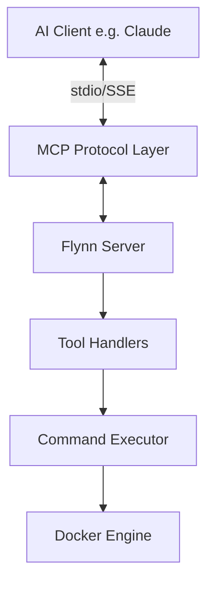

# Flynn Architecture

Flynn is built on the Model Context Protocol (MCP) and uses a layered architecture to bridge AI assistants with Docker operations.

## System Overview

## Components

### 1. Protocol Layer (`mcp`)
Handles the low-level communication implementing the Model Context Protocol specification. It manages:
- JSON-RPC message framing
- Protocol negotiation
- Capability exchange

### 2. Server Layer (`server.py`)
The main entry point that defines:
- Available tools (`create-container`, `deploy-compose`, etc.)
- Prompts (`deploy-stack`, `analyze-containers`)
- Resource access policies

### 3. Handler Layer (`handlers.py`)
Implements the business logic for each tool. It is responsible for:
- Input validation
- Data processing
- Error handling
- Formatting responses

### 4. Abstraction Layer (`python-on-whales`)
We use `python-on-whales` as a high-level Pythonic interface to the Docker CLI. This provides:
- Type-safe Docker interactions
- Native object mapping (Container, Image, etc.)
- consistent error handling

## Data Flow

### Tool Execution Flow
1. **Request**: AI Client sends `call_tool` request
2. **Routing**: `server.py` routes to appropriate handler
3. **Execution**: `handlers.py` calls Docker API
4. **Response**: Result is formatted as `TextContent` and returned

### Error Handling
Errors are caught at the handler level and returned as formatted text failures to the AI, allowing the model to understand what went wrong and attempt self-correction.

## Extension Points

Flynn is designed to be extensible. New tools can be added by:
1. Defining the tool schema in `server.py`
2. Implementing the logic in `handlers.py`
3. Registering the handler in the `handle_call_tool` dispatcher
